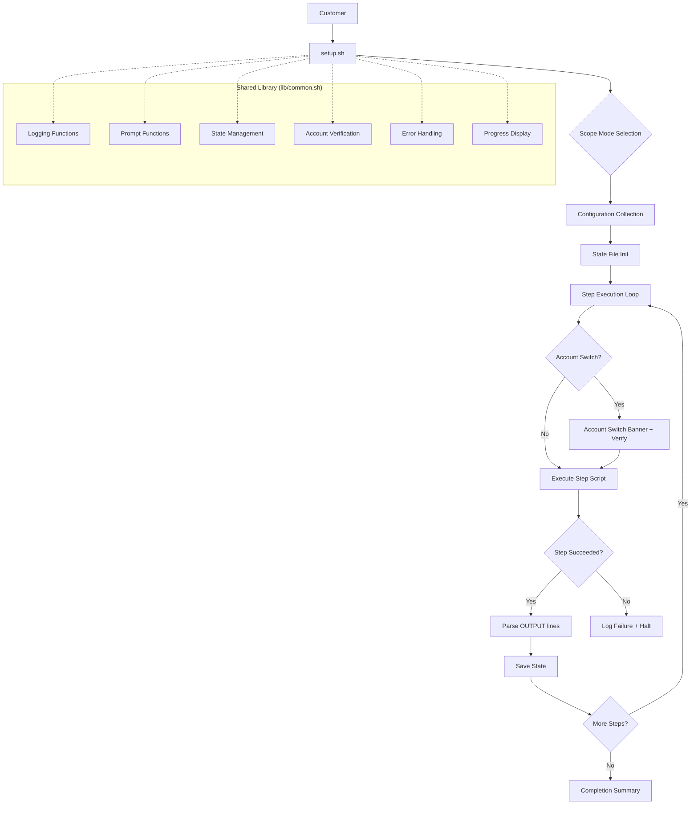
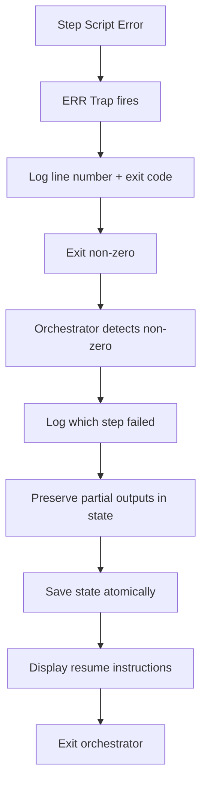

# Design Document: JIT Setup Orchestrator

## Overview

The JIT Setup Orchestrator is a bash-based orchestration system that unifies five distinct JIT setup workflows (AWS JIT DB, AWS JIT VM, AWS JIT EKS, Azure JIT DB, Azure JIT K8s) behind a consistent, resumable, idempotent execution framework. The orchestrator provides a single `setup.sh` entry point per setup type that drives configuration collection, multi-account credential verification, sequential step execution, state persistence, and cleanup/rollback.

### Design Goals

1. **Unified UX**: All five setup types present identical interaction patterns (prompts, progress, logging, account-switch banners)
2. **Resumability**: Interrupted setups resume from the last incomplete step without re-collecting config or re-running completed steps
3. **Idempotency**: Every step script uses check-before-create patterns so re-execution is safe
4. **Composability**: Step scripts are standalone executables that receive all inputs via environment variables and emit structured outputs via the `OUTPUT:` protocol
5. **Minimal Dependencies**: Bash 4+, jq, and the relevant cloud CLI (aws/az) — no additional runtimes

### Design Rationale

The orchestrator is implemented in pure bash rather than Python/Go because:
- The existing scripts are all bash and customers already have bash environments configured
- Cloud CLI tools (aws, az) are natively invoked from bash without wrappers
- No additional runtime installation is required on customer machines
- The complexity is in orchestration (sequencing, state, prompts), not computation

## Architecture



### High-Level Flow

1. Customer runs `setup.sh` in a setup-type directory
2. Orchestrator sources `lib/common.sh`
3. Orchestrator presents scope mode menu
4. Orchestrator loads or initializes state file
5. If fresh: collect all configuration up front, validate, confirm
6. If resuming: load config from state, skip completed steps
7. For each step: verify account context, execute step script, capture outputs, update state
8. On completion: display summary
9. On failure: halt, preserve state for resume

## Components and Interfaces

### Directory Structure

```
artifacts/
├── lib/
│   └── common.sh                    # Shared library (sourced by all scripts)
├── aws-jit-db/
│   ├── setup.sh                     # Orchestrator entry point
│   ├── config.sh                    # Configuration schema definition
│   ├── steps/
│   │   ├── 01-sync-ecr.sh
│   │   ├── 02-install-workloads.sh
│   │   ├── 03-setup-vpc-peering.sh
│   │   ├── 04-accept-peering.sh
│   │   ├── 05-update-assume-role.sh
│   │   └── 06-create-permission-set.sh
│   └── cleanup/
│       └── cleanup.sh
├── aws-jit-vm/
│   ├── setup.sh
│   ├── config.sh
│   ├── steps/
│   │   ├── 01-create-permission-set.sh
│   │   ├── 02-sync-ecr.sh
│   │   ├── 03-install-workloads.sh
│   │   ├── 04-setup-vpc-peering.sh
│   │   ├── 05-accept-peering.sh
│   │   └── 06-store-ssh-key.sh
│   └── cleanup/
│       └── cleanup.sh
├── aws-jit-eks/
│   ├── setup.sh
│   ├── config.sh
│   ├── steps/
│   │   ├── 01-attach-eks-policies.sh
│   │   ├── 02-setup-bastion-hub.sh
│   │   ├── 03-setup-vpc-peering.sh
│   │   ├── 04-accept-peering.sh
│   │   └── 05-create-permission-sets.sh
│   └── cleanup/
│       └── cleanup.sh
├── azure-jit-db/
│   ├── setup.sh
│   ├── config.sh
│   ├── steps/
│   │   ├── 01-sync-acr.sh
│   │   ├── 02-setup-infra.sh
│   │   ├── 03-deploy-aci.sh
│   │   ├── 04-create-custom-role.sh
│   │   ├── 05-connect-db.sh
│   │   └── 06-create-sp-and-binding.sh
│   └── cleanup/
│       └── cleanup.sh
└── azure-jit-k8s/
    ├── setup.sh
    ├── config.sh
    ├── steps/
    │   ├── 01-create-custom-roles.sh
    │   ├── 02-setup-hub-vnet-and-vm.sh
    │   ├── 03-setup-peering-role-and-dns.sh
    │   └── 04-extend-role-scopes.sh
    └── cleanup/
        └── cleanup.sh
```

### Component: Shared Library (`lib/common.sh`)

The shared library provides all reusable functions. It is sourced at the top of every orchestrator and step script.

#### Logging Functions

```bash
# All logging functions prefix with timestamp and severity indicator
# Format: [HH:MM:SS] [SEVERITY] message
# When stdout is not a TTY or TERM is "dumb", ANSI colors are omitted

log()   # General log line — [HH:MM:SS] [INFO] message
ok()    # Success indicator — [HH:MM:SS] [OK] message (green)
info()  # Informational — [HH:MM:SS] [INFO] message (blue)
warn()  # Warning — [HH:MM:SS] [WARN] message (yellow)
error() # Error — [HH:MM:SS] [ERROR] message (red)
step()  # Section header — [HH:MM:SS] [STEP] ━━━ message ━━━
```

#### Prompt Functions

```bash
# prompt_with_default PROMPT DEFAULT_VALUE
#   Displays: "PROMPT [DEFAULT_VALUE]: "
#   Returns: user input or default if empty
prompt_with_default()

# prompt_yes_no PROMPT DEFAULT(y/n)
#   Returns: 0 for yes, 1 for no
prompt_yes_no()

# prompt_selection PROMPT OPTIONS_ARRAY
#   Displays numbered menu, returns selected value
#   Retries up to 3 times on invalid input
prompt_selection()
```

#### State Management Functions

```bash
# save_state STATE_FILE
#   Writes state JSON to temp file, then atomically renames
save_state()

# load_state STATE_FILE
#   Reads and parses state file, returns 0 if valid, 1 if corrupt/missing
load_state()

# mark_step_complete STATE_FILE STEP_ID OUTPUTS_JSON
#   Marks a step as complete with timestamp and outputs in state
mark_step_complete()

# is_step_complete STATE_FILE STEP_ID
#   Returns 0 if step is marked complete, 1 otherwise
is_step_complete()

# get_step_output STATE_FILE STEP_ID KEY
#   Returns the output value for a completed step's key
get_step_output()

# set_config_value STATE_FILE KEY VALUE
#   Stores a configuration value in the state file
set_config_value()

# get_config_value STATE_FILE KEY
#   Retrieves a configuration value from state
get_config_value()
```

#### Progress Display

```bash
# show_progress CURRENT_STEP TOTAL_STEPS STEP_NAME
#   Displays: [Step N/M] (XX%) step_name
show_progress()
```

#### Account Verification

```bash
# verify_aws_account EXPECTED_ACCOUNT_ID
#   Runs: aws sts get-caller-identity
#   Returns 0 if current account matches expected, 1 otherwise
#   Outputs: actual account ID to stdout on mismatch
verify_aws_account()

# verify_azure_subscription EXPECTED_SUBSCRIPTION_ID
#   Runs: az account show
#   Returns 0 if current subscription matches expected, 1 otherwise
verify_azure_subscription()
```

#### Error Handling

```bash
# handle_error LINE_NUMBER EXIT_CODE
#   Trap handler for ERR signal
#   Logs: [ERROR] Script failed at line N with exit code X
#   Exits with the captured exit code
handle_error()
```

### Component: Configuration Schema (`config.sh`)

Each setup type defines a `config.sh` that declares the configuration fields, their validation rules, default values, and which scope modes require them. The orchestrator sources this file during configuration collection.

```bash
# config.sh structure (example for aws-jit-db)

# Declare scope modes
SCOPE_MODES=("new-vpc" "existing-vpc" "same-account")
SCOPE_MODE_LABELS=("New VPC with peering" "Existing VPC (cross-account)" "Existing VPC (same account)")

# Declare steps per scope mode (ordered)
declare -A STEPS_FOR_MODE
STEPS_FOR_MODE["new-vpc"]="01-sync-ecr 02-install-workloads 03-setup-vpc-peering 04-accept-peering 05-update-assume-role 06-create-permission-set"
STEPS_FOR_MODE["existing-vpc"]="01-sync-ecr 02-install-workloads 03-setup-vpc-peering 04-accept-peering 05-update-assume-role"
STEPS_FOR_MODE["same-account"]="01-sync-ecr 02-install-workloads 05-update-assume-role"

# Declare account context per step
declare -A STEP_ACCOUNT
STEP_ACCOUNT["01-sync-ecr"]="jit-workload"
STEP_ACCOUNT["02-install-workloads"]="jit-workload"
STEP_ACCOUNT["03-setup-vpc-peering"]="jit-workload"
STEP_ACCOUNT["04-accept-peering"]="db-account"
STEP_ACCOUNT["05-update-assume-role"]="jit-workload"
STEP_ACCOUNT["06-create-permission-set"]="management"

# Declare step labels (for display)
declare -A STEP_LABELS
STEP_LABELS["01-sync-ecr"]="Sync ECR Images"
STEP_LABELS["02-install-workloads"]="Install Workload Infrastructure"
# ...

# Declare configuration fields
# Format: FIELD_NAME|VALIDATION_RULE|DEFAULT_VALUE|PROMPT_TEXT|SCOPE_MODES|SENSITIVE
CONFIG_FIELDS=(
    "AWS_REGION|region|us-east-1|AWS Region|*|false"
    "JIT_ACCOUNT_ID|aws_account_id||JIT Workload Account ID|*|false"
    "DB_ACCOUNT_ID|aws_account_id||Database Account ID|new-vpc,existing-vpc|false"
    "MGMT_ACCOUNT_ID|aws_account_id||Management Account ID|new-vpc|false"
    "VPC_CIDR|cidr|10.50.0.0/16|VPC CIDR Block|new-vpc|false"
    "PROJECT_NAME|alphanumeric_dash|cdx-jit-db|Project Name|*|false"
    "IMAGE_TAG|semver_or_latest|latest|Image Tag|*|false"
    "ENABLE_DAM|boolean|false|Enable Database Activity Monitoring|*|false"
)

# Validation rules (functions defined in common.sh):
# - aws_account_id: 12-digit numeric
# - azure_subscription_id: UUID format
# - cidr: valid CIDR notation (X.X.X.X/N)
# - arn: valid ARN format
# - region: known AWS region string
# - alphanumeric_dash: [a-zA-Z0-9-]+
# - semver_or_latest: semantic version or "latest"
# - boolean: "true" or "false"
# - nonempty: any non-empty string
```

### Component: Orchestrator (`setup.sh`)

The orchestrator is the main entry point. Its responsibilities:

1. Source `lib/common.sh`
2. Source `config.sh` for the current setup type
3. Handle `--cleanup` flag for teardown mode
4. Present scope mode menu
5. Load or initialize state file
6. Collect or restore configuration
7. Execute step loop with account verification
8. Handle completion/failure

```bash
#!/usr/bin/env bash
set -euo pipefail

SCRIPT_DIR="$(cd "$(dirname "${BASH_SOURCE[0]}")" && pwd)"
LIB_DIR="$(cd "$SCRIPT_DIR/../lib" && pwd)"

# Source shared library
if [[ ! -f "$LIB_DIR/common.sh" ]]; then
    echo "[ERROR] Shared library not found: $LIB_DIR/common.sh" >&2
    exit 1
fi
source "$LIB_DIR/common.sh"

# Source configuration schema
source "$SCRIPT_DIR/config.sh"

STATE_FILE="$SCRIPT_DIR/.state.json"

# Parse flags
if [[ "${1:-}" == "--cleanup" ]]; then
    run_cleanup "$STATE_FILE" "$SCRIPT_DIR/cleanup/cleanup.sh"
    exit $?
fi

# Main orchestration flow...
```

### Component: Step Scripts (`steps/*.sh`)

Each step script conforms to a strict contract:

**Input Contract:**
- All configuration received via environment variables (never interactive prompts)
- The orchestrator exports all config values and prior step outputs before invoking
- Missing required variables cause immediate exit with error message

**Output Contract:**
- Resource identifiers emitted as `OUTPUT:<KEY>=<VALUE>` lines on stdout
- Regular log messages also on stdout (orchestrator distinguishes by prefix)
- Exit code 0 on success, non-zero on failure
- Partially-created resources left intact (no self-cleanup on failure)

**Idempotency Contract:**
- Every resource creation preceded by an existence check
- Pattern: describe/query → if exists, log "reused" and emit OUTPUT → else create, log "created" and emit OUTPUT
- Policy/role attachments use `|| true` to handle "already attached" responses

### Component: State File (`.state.json`)

```json
{
  "version": 1,
  "setup_type": "aws-jit-db",
  "scope_mode": "new-vpc",
  "started_at": "2024-01-15T10:30:00Z",
  "config": {
    "AWS_REGION": "us-east-1",
    "JIT_ACCOUNT_ID": "123456789012",
    "DB_ACCOUNT_ID": "987654321098",
    "VPC_CIDR": "10.50.0.0/16",
    "PROJECT_NAME": "cdx-jit-db",
    "IMAGE_TAG": "latest",
    "ENABLE_DAM": "false"
  },
  "steps": {
    "01-sync-ecr": {
      "status": "complete",
      "completed_at": "2024-01-15T10:35:22Z",
      "outputs": {
        "ECR_REPO_URI": "123456789012.dkr.ecr.us-east-1.amazonaws.com/cloudanix/ecr-aws-jit-proxy-sql"
      }
    },
    "02-install-workloads": {
      "status": "complete",
      "completed_at": "2024-01-15T10:42:15Z",
      "outputs": {
        "VPC_ID": "vpc-0abc123def456",
        "PRIVATE_SUBNET_1_ID": "subnet-0aaa111",
        "PRIVATE_SUBNET_2_ID": "subnet-0bbb222",
        "CLUSTER_NAME": "cdx-jit-db-cluster",
        "ECS_ROLE_ARN": "arn:aws:iam::123456789012:role/cdx-ECSTaskRole"
      }
    },
    "03-setup-vpc-peering": {
      "status": "incomplete"
    }
  }
}
```

**Atomic Write Guarantee:** State is always written to `.state.json.tmp` first, then `mv`'d to `.state.json`. This prevents corruption from interrupts during write.

### Component: Cleanup Scripts

Each setup type has a `cleanup/cleanup.sh` that reverses the setup. The orchestrator invokes it when `--cleanup` is passed.

**Cleanup Behavior:**
- Reads the state file to determine what was created
- Executes cleanup operations in reverse order of creation
- Each cleanup step is wrapped in `|| true` — failures are logged but don't halt cleanup
- Produces a summary showing which resources were successfully removed and which failed

## Data Models

### State File Schema

| Field | Type | Description |
|-------|------|-------------|
| `version` | integer | Schema version (currently 1) |
| `setup_type` | string | One of: aws-jit-db, aws-jit-vm, aws-jit-eks, azure-jit-db, azure-jit-k8s |
| `scope_mode` | string | Selected scope mode for this setup run |
| `started_at` | string | ISO 8601 UTC timestamp of first run |
| `config` | object | Key-value map of all user-provided configuration |
| `steps` | object | Map of step_id → step status object |
| `steps.<id>.status` | string | One of: complete, incomplete |
| `steps.<id>.completed_at` | string | ISO 8601 UTC timestamp (only when complete) |
| `steps.<id>.outputs` | object | Key-value map of OUTPUT lines captured from step |

### Configuration Field Schema

| Field | Type | Description |
|-------|------|-------------|
| `name` | string | Environment variable name (uppercase, underscores) |
| `validation` | string | Validation rule identifier |
| `default` | string | Default value (empty string if required) |
| `prompt` | string | Human-readable prompt text |
| `scope_modes` | string | Comma-separated list of modes requiring this field, or `*` for all |
| `sensitive` | boolean | Whether to mask value in summary display |

### OUTPUT Protocol Format

```
OUTPUT:<KEY>=<VALUE>
```

- `KEY`: `[A-Z][A-Z0-9_]{0,63}` (alphanumeric + underscore, max 64 chars, starts with letter)
- `VALUE`: any printable string, max 256 characters, no newlines
- Lines not matching this pattern are treated as regular log output
- Malformed OUTPUT lines (matching `OUTPUT:` prefix but invalid format) produce a warning

### Validation Rules

| Rule | Pattern | Example Valid |
|------|---------|--------------|
| `aws_account_id` | `^\d{12}$` | 123456789012 |
| `azure_subscription_id` | UUID v4 format | a1b2c3d4-e5f6-7890-abcd-ef1234567890 |
| `cidr` | `^\d{1,3}\.\d{1,3}\.\d{1,3}\.\d{1,3}/\d{1,2}$` | 10.50.0.0/16 |
| `arn` | `^arn:aws[a-zA-Z-]*:[a-zA-Z0-9-]+:\S+$` | arn:aws:iam::123:role/MyRole |
| `region` | known AWS region list | us-east-1 |
| `alphanumeric_dash` | `^[a-zA-Z0-9-]+$` | cdx-jit-db |
| `semver_or_latest` | semver or "latest" | latest, 1.2.3 |
| `boolean` | `^(true\|false)$` | true |
| `nonempty` | `.+` | anything |

## Correctness Properties

*A property is a characteristic or behavior that should hold true across all valid executions of a system — essentially, a formal statement about what the system should do. Properties serve as the bridge between human-readable specifications and machine-verifiable correctness guarantees.*

### Property 1: State file round-trip integrity

*For any* valid state object containing arbitrary configuration key-value pairs, step completion records with ISO 8601 timestamps, and output key-value pairs, serializing the state via `save_state` and then deserializing via `load_state` SHALL produce a JSON object where every config key, step status, step timestamp, and output value is identical to the original.

**Validates: Requirements 4.2, 4.6, 8.3**

### Property 2: OUTPUT protocol parsing correctness

*For any* stdout stream containing an arbitrary interleaving of regular log lines, valid `OUTPUT:<KEY>=<VALUE>` lines (where KEY is alphanumeric+underscore ≤64 chars and VALUE is ≤256 chars), and malformed lines matching `OUTPUT:` prefix but violating the format, the parse function SHALL extract exactly the valid OUTPUT pairs and ignore all other lines.

**Validates: Requirements 8.1, 8.2, 8.5**

### Property 3: Configuration validation correctness

*For any* input string and validation rule (aws_account_id, azure_subscription_id, cidr, arn, region, alphanumeric_dash, boolean), the validation function SHALL return success if and only if the input matches the rule's defined regular expression pattern — accepting all conforming inputs and rejecting all non-conforming inputs.

**Validates: Requirements 7.2**

### Property 4: Step sequencing invariants

*For any* setup type and scope mode combination defined in the configuration schema, the returned step list SHALL be non-empty, contain no duplicate step identifiers, and be a valid subsequence of the canonical step ordering for that setup type.

**Validates: Requirements 1.2**

### Property 5: Resume skips exactly completed steps

*For any* state file with K steps marked complete out of M total steps (0 ≤ K ≤ M), the resume function SHALL return a pending step list of exactly M - K steps, beginning at step K + 1 in the defined order, preserving the relative ordering of remaining steps.

**Validates: Requirements 4.3, 4.4**

### Property 6: Logging format consistency

*For any* message string passed to any shared library logging function (log, ok, info, warn, error, step), the output SHALL match the pattern `\[HH:MM:SS\] \[SEVERITY\] .*` where SEVERITY is one of INFO, OK, WARN, ERROR, STEP and the timestamp represents a valid time.

**Validates: Requirements 3.1, 3.5**

### Property 7: Sensitive value masking

*For any* string of length L designated as sensitive, the masking function SHALL output a string where the first max(0, L-4) characters are replaced with asterisks and only the last min(4, L) characters are visible.

**Validates: Requirements 7.3**

### Property 8: Cleanup reverse ordering and continuation

*For any* state file with completed steps [S1, S2, ..., SN], cleanup SHALL invoke cleanup operations in the order [SN, SN-1, ..., S2, S1], and if any cleanup step Si fails with an error, all remaining steps S(i-1) through S1 SHALL still be attempted.

**Validates: Requirements 9.2, 9.3**

## Error Handling

### Strategy by Layer

| Layer | Error Type | Handling |
|-------|-----------|----------|
| Orchestrator | Invalid user input (menu) | Re-prompt up to 3 times, then exit |
| Orchestrator | State file corrupt | Prompt: start fresh or abort |
| Orchestrator | State file write failure | Exit with error (no partial state written due to atomic mv) |
| Orchestrator | Account mismatch | Display expected vs actual, prompt to retry |
| Step Script | Missing env variable | Exit within 5 seconds with message naming the variable |
| Step Script | Cloud API failure | ERR trap catches line number + exit code, exits non-zero |
| Step Script | "Already exists" response | Treat as success, emit OUTPUT with existing resource ID |
| Step Script | Partial failure | Exit non-zero, leave created resources intact |
| Cleanup | Individual step failure | Log failure + resource IDs, continue with remaining steps |
| Shared Library | Library file missing | Immediate exit with path in error message |

### Error Propagation Flow



### Multi-Account Error Handling

When a step requires a different account context:
1. Orchestrator displays the account switch banner (colored, bordered)
2. Prompts for confirmation
3. Calls `verify_aws_account` or `verify_azure_subscription`
4. On mismatch: shows expected vs actual, prompts to retry
5. Loop continues until match or user aborts

## Testing Strategy

### Unit Tests (bats-core)

Unit tests validate individual functions from `lib/common.sh` in isolation using [bats-core](https://github.com/bats-core/bats-core):

- **Logging functions**: Verify output format (timestamp + severity prefix), color vs plain mode
- **Validation functions**: Test each rule with known valid/invalid inputs (examples + edge cases)
- **State management**: Test save/load, atomic write behavior, corrupt file handling
- **OUTPUT parsing**: Test extraction with known mixed input
- **Prompt functions**: Test default value handling with mocked stdin
- **Account verification**: Test with mocked `aws`/`az` CLI responses
- **Error handler**: Test ERR trap captures line number and exit code

### Property-Based Tests (fast-check via Node.js harness)

The core logic involves string parsing (OUTPUT protocol), JSON serialization (state files), and input validation (regex patterns) — all well-suited for property-based testing. A Node.js test harness using `fast-check` generates random inputs and shells out to the bash functions under test.

- **Library**: fast-check (JavaScript/TypeScript)
- **Minimum iterations**: 100 per property
- **Tag format**: `Feature: jit-setup-orchestrator, Property N: <property_text>`

**Property tests implemented:**

| Property | What's Generated | What's Verified |
|----------|-----------------|-----------------|
| 1: State round-trip | Random config maps, step IDs, output maps, timestamps | `save_state` → `load_state` = identity |
| 2: OUTPUT parsing | Random mix of log lines + valid/invalid OUTPUT lines | Extracted pairs = exactly the valid ones |
| 3: Validation | Random strings × each validation rule | Accept iff matches defined regex |
| 4: Step sequencing | Random (setup_type, scope_mode) pairs | Non-empty, no duplicates, valid subsequence |
| 5: Resume skip | Random state with K/M steps complete | Pending list has M-K items starting at K+1 |
| 6: Logging format | Random message strings × each log function | Output matches `[HH:MM:SS] [SEVERITY] ...` |
| 7: Masking | Random strings of length 0-100 | Only last 4 chars visible, rest asterisked |
| 8: Cleanup order | Random completed step lists | Cleanup invoked in reverse; failures don't halt |

### Integration Tests (bats-core with mock CLIs)

Integration tests run the full orchestrator end-to-end with cloud CLIs replaced by bash functions:

- **Mock approach**: `aws()` and `az()` bash functions in the test that simulate API responses (exists/not-exists/error cases)
- **Test scenarios**:
  - Fresh setup: all steps execute in order, state file created with all outputs
  - Resume: state with 2/5 steps complete → only steps 3-5 execute
  - Account mismatch: mock returns wrong account → banner re-prompts
  - Validation rejection: invalid inputs are rejected, valid accepted
  - Idempotent rerun: all resources "exist" → no creation, outputs still captured
  - Cleanup with failures: some cleanup steps fail → rest still execute
  - Corrupt state file: invalid JSON → error message + prompt to start fresh
  - Missing library: remove common.sh → error + exit

### Test Configuration

```
Property tests: 100+ iterations per property (fast-check default: 100)
Unit tests: bats-core 1.10+
Integration tests: bats-core with PATH-prepended mock binaries
CI: Run on bash 4.4+ and bash 5.x (both macOS and Linux)
Dependencies: Node.js 18+ (for fast-check), jq 1.6+, bats-core
```
